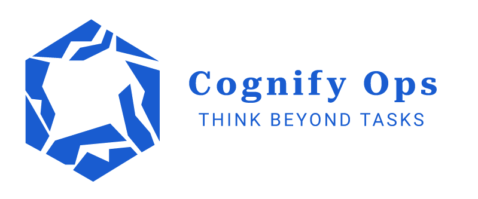

# **CognifyOps**

**Intelligent Project Management Powered by AI**

🚀 **CognifyOps** is a Jira-inspired project management platform with **Intellecta**, an integrated AI assistant that answers project-related questions using contextual insights from your tickets, sprints, and documentation.

---

## **Key Features**

- **Jira-like Project Management**:

  - Create projects, epics, tickets, and sprints.

  - Track statuses, assignees, and deadlines.

- **Intellecta AI Portal**:

  - Ask natural language questions (e.g., *"Summarize sprint progress"* or *"Explain the project domain"*).

  - Get responses grounded in your project data using **RAG (Retrieval Augmented Generation)**.

  - Custom-trained on your workflows via **fine-tuned foundation models** (AWS Bedrock/OpenAI).
