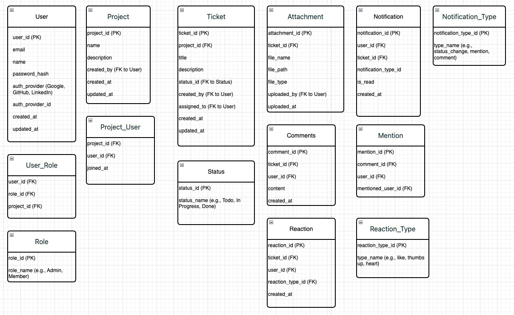

## Initial ERD (Without Ai)

## Jira-like Application ERD Documentation

## Overview

This Entity-Relationship Diagram (ERD) represents a Jira-like project management application with features including user authentication, project creation, ticket management, comments, mentions, reactions, and notifications.

## Key Entities

1.  User: Stores user information and authentication details.

2.  Role & User_Role: Manages user roles within projects.

3.  Project & Project_User: Represents projects and user associations.

4.  Ticket: Core entity for task/issue tracking.

5.  Status: Defines ticket statuses (e.g., Todo, In Progress, Done).

6.  Comment & Mention: Handles user comments and mentions.

7.  Reaction & Reaction_Type: Manages user reactions to tickets.

8.  Notification & Notification_Type: Tracks system notifications.

9.  Attachment: Stores files attached to tickets.

## Key Relationships

- Users can have multiple roles across different projects.

- Projects can have multiple users and tickets.

- Tickets are associated with a project, creator, and assignee.

- Comments, reactions, and attachments are linked to specific tickets.

- Notifications are generated for various ticket-related events.

## Normalization

The ERD adheres to Third Normal Form (3NF), with separate tables for Status, Notification_Type, and Reaction_Type to ensure data integrity and reduce redundancy.

## Design Considerations

- Supports multiple authentication providers (Google, GitHub, LinkedIn).

- Allows for flexible role management within projects.

- Enables rich interaction through comments, mentions, and reactions.

- Provides a notification system for important updates.

## 1\. **User**

**Table Name:** `User`

**Columns:**

- `user_id` **(PK)**
- `email`
- `name`
- `password_hash`
- `auth_provider` (e.g. Google, GitHub, LinkedIn)
- `auth_provider_id`
- `created_at`
- `updated_at`

**Key Points & Relationships:**

- **Primary Key (PK):** `user_id`
- A **User** can:
  - Create many **Projects** (`Project.created_by → User.user_id`)
  - Create many **Tickets** (`Ticket.created_by → User.user_id`)
  - Write many **Comments** (`Comments.user_id → User.user_id`)
  - Have many **Reactions** (`Reaction.user_id → User.user_id`)
  - Receive many **Notifications** (`Notification.user_id → User.user_id`)
  - Be mentioned in many **Mentions** (if your design stores `mentioned_user_id` in `Mention`)
  - Have multiple **Roles** through the `User_Role` join table

---

## 2\. **Role**

**Table Name:** `Role`

**Columns:**

- `role_id` **(PK)**
- `role_name` (e.g. Admin, Member, etc.)
- `created_at`
- `updated_at`

**Key Points & Relationships:**

- **Primary Key (PK):** `role_id`
- A **Role** can be assigned to many **Users** through `User_Role`.

---

## 3\. **User_Role**

**Table Name:** `User_Role`

**Columns:**

- `user_id` **(FK)** → `User.user_id`
- `role_id` **(FK)** → `Role.role_id`
- `project_id` **(FK)** → `Project.project_id`
- `created_at`
- `updated_at`

**Key Points & Relationships:**

- **Foreign Keys (FK):**
  - `user_id` references `User.user_id`
  - `role_id` references `Role.role_id`
  - `project_id` references `Project.project_id`

---

## 4\. **Project**

**Table Name:** `Project`

**Columns:**

- `project_id` **(PK)**
- `name`
- `description`
- `created_by` **(FK)** → `User.user_id`
- `created_at`
- `updated_at`

**Key Points & Relationships:**

- **Primary Key (PK):** `project_id`
- **Foreign Key (FK):** `created_by` references `User.user_id` (the user who created the project)
- A **Project** can have many **Tickets**.
- A **Project** can have many **Users** through `Project_User`.

---

## 5\. **Project_User**

**Table Name:** `Project_User`

**Columns:**

- `project_id` **(PK, FK)** → `Project.project_id`
- `user_id` **(PK, FK)** → `User.user_id`
- `joined_at`
- `updated_at`

**Key Points & Relationships:**

- **Composite Primary Key (PK):** `(project_id, user_id)`
- **Foreign Keys (FK):**
  - `project_id` references `Project.project_id`
  - `user_id` references `User.user_id`
- Many-to-many relationship between **Project** and **User** realized through `Project_User`.

---

## 6\. **Ticket**

**Table Name:** `Ticket`

**Columns:**

- `ticket_id` **(PK)**
- `project_id` **(FK)** → `Project.project_id`
- `name`
- `description`
- `created_by` **(FK)** → `User.user_id`
- `status_id` **(FK)** → `Status.status_id`
- `created_at`
- `updated_at`

**Key Points & Relationships:**

- **Primary Key (PK):** `ticket_id`
- **Foreign Keys (FK):**
  - `project_id` references `Project.project_id`
  - `created_by` references `User.user_id`
  - `status_id` references `Status.status_id`
- A **Ticket** can have many **Attachments**, many **Comments**, and many **Mentions**.

---

## 7\. **Status**

**Table Name:** `Status`

**Columns:**

- `status_id` **(PK)**
- `name` (e.g. "To Do", "In Progress", "Done")
- `created_at`
- `updated_at`

**Key Points & Relationships:**

- **Primary Key (PK):** `status_id`
- One **Status** can be associated with many **Tickets**.

---

## 8\. **Attachment**

**Table Name:** `Attachment`

**Columns:**

- `attachment_id` **(PK)**
- `ticket_id` **(FK)** → `Ticket.ticket_id`
- `file_name`
- `file_path`
- `created_at`
- `updated_at`

**Key Points & Relationships:**

- **Primary Key (PK):** `attachment_id`
- **Foreign Key (FK):** `ticket_id` references `Ticket.ticket_id`
- One **Ticket** can have many **Attachments**.

---

## 9\. **Comments**

**Table Name:** `Comments`

**Columns:**

- `comment_id` **(PK)**
- `ticket_id` **(FK)** → `Ticket.ticket_id`
- `user_id` **(FK)** → `User.user_id`
- `comment_text`
- `created_at`
- `updated_at`

**Key Points & Relationships:**

- **Primary Key (PK):** `comment_id`
- **Foreign Keys (FK):**
  - `ticket_id` references `Ticket.ticket_id`
  - `user_id` references `User.user_id`
- A **Comment** can have many **Reactions**.

---

## 10\. **Mention**

**Table Name:** `Mention`

**Columns:**

- `mention_id` **(PK)**
- `ticket_id` **(FK)** → `Ticket.ticket_id`
- `mentioner_user_id` **(FK)** → `User.user_id` (the user who is making the mention)
- `mentioned_user_id` **(FK)** → `User.user_id` (the user who is being mentioned)
- `created_at`
- `updated_at`

_(Note: The exact naming of columns may differ. In the ERD, you might see `mention_to`/`mention_user`, etc. Adjust as needed.)_

**Key Points & Relationships:**

- **Primary Key (PK):** `mention_id`
- **Foreign Keys (FK):**
  - `ticket_id` references `Ticket.ticket_id`
  - `mentioner_user_id` references `User.user_id`
  - `mentioned_user_id` references `User.user_id`
- A **Ticket** can have many **Mentions**; each **Mention** links two users (mentioner and mentioned).

---

## 11\. **Reaction**

**Table Name:** `Reaction`

**Columns:**

- `reaction_id` **(PK)**
- `comment_id` **(FK)** → `Comments.comment_id`
- `user_id` **(FK)** → `User.user_id`
- `reaction_type_id` **(FK)** → `Reaction_Type.reaction_type_id`
- `created_at`
- `updated_at`

**Key Points & Relationships:**

- **Primary Key (PK):** `reaction_id`
- **Foreign Keys (FK):**
  - `comment_id` references `Comments.comment_id`
  - `user_id` references `User.user_id`
  - `reaction_type_id` references `Reaction_Type.reaction_type_id`
- A **Comment** can have many **Reactions**.

---

## 12\. **Reaction_Type**

**Table Name:** `Reaction_Type`

**Columns:**

- `reaction_type_id` **(PK)**
- `name` (e.g. like, heart, thumbs_up, laugh)
- `created_at`
- `updated_at`

**Key Points & Relationships:**

- **Primary Key (PK):** `reaction_type_id`
- One **Reaction_Type** can be associated with many **Reactions**.

---

## 13\. **Notification**

**Table Name:** `Notification`

**Columns:**

- `notification_id` **(PK)**
- `user_id` **(FK)** → `User.user_id` (the user receiving the notification)
- `notification_type_id` **(FK)** → `Notification_Type.notification_type_id`
- `message`
- `read_status` (boolean or similar)
- `attributes` (JSON or text for extra info)
- `created_at`
- `updated_at`

**Key Points & Relationships:**

- **Primary Key (PK):** `notification_id`
- **Foreign Keys (FK):**
  - `user_id` references `User.user_id`
  - `notification_type_id` references `Notification_Type.notification_type_id`
- One **User** can have many **Notifications**.

---

## 14\. **Notification_Type**

**Table Name:** `Notification_Type`

**Columns:**

- `notification_type_id` **(PK)**
- `name` (e.g. "comment", "mention", etc.)
- `created_at`
- `updated_at`

**Key Points & Relationships:**

- **Primary Key (PK):** `notification_type_id`
- One **Notification_Type** can be associated with many **Notifications**.

---

# Relationships Summary

1.  **User** → **Project**:

    - One user (via `created_by`) can create many projects.

2.  **User** → **Ticket**:

    - One user (via `created_by`) can create many tickets.

3.  **User** → **Comments**:

    - One user can write many comments.

4.  **User** → **Reaction**:

    - One user can create many reactions.

5.  **User** → **Notification**:

    - One user can receive many notifications.

6.  **User** ↔ **Role** (via `User_Role`):

    - Many-to-many (a user can have multiple roles; a role can be assigned to multiple users).

7.  **Project** ↔ **User** (via `Project_User`):

    - Many-to-many (a project can have multiple users, a user can be in multiple projects).

8.  **Project** → **Ticket**:

    - One project can have many tickets.

9.  **Ticket** → **Attachment**:

    - One ticket can have many attachments.

10. **Ticket** → **Comments**:

    - One ticket can have many comments.

11. **Ticket** → **Mention**:

    - One ticket can have many mentions (each mention also references two users).

12. **Comments** → **Reaction**:

    - One comment can have many reactions.

13. **Reaction_Type** → **Reaction**:

    - One reaction type can be used by many reactions.

14. **Notification_Type** → **Notification**:

    - One notification type can be used by many notifications.

15. **Status** → **Ticket**:

    - One status can be used by many tickets.
