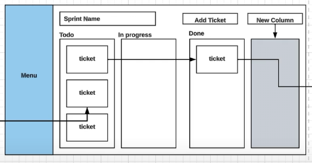

# Sprint Board

## Requirements

### Functional

1. Manage existing sprints.
2. Create new tickets.
3. Reorder tickets by columns.
4. Each ticket can be assigned to only one user at a time.
5. Create new columns.
6. Filter tickets by author.
7. Complete sprints.
8. Search for tickets.

### Non-Functional

1. [Evaluate server-side rendering (SSR) vs. client-side rendering (CSR)](#ssr-vs-csr)
2. Ensure responsive design with a focus on web platforms.
3. Provide the illusion of real-time updates without implementing full real-time functionality.
4. Implement shimmer loaders for a smoother loading experience.
5. Maintain accessibility (A11y) standards.
6. Optimize for performance.
7. Support internationalization.
8. Enhance observability and tracking.

# SSR vs. CSR

## Key Considerations

1. **Initial Load Speed:**
   - Do we care about how quickly the application loads for the first time?
2. **Fast Initial Load:**
   - Is it important that users see content as soon as possible?
3. **SEO Requirements:**
   - Do we need our content to be easily discoverable by search engines?

> **If all three are priorities:**  
> **SSR (Server-Side Rendering)** is generally more effective because it pre-renders pages on the server, resulting in faster initial load times and better SEO.

## For Highly Interactive Applications

4. **Interactive Functionality:**
   - Are you building a highly interactive website, such as a chat application or any system that relies heavily on client-side interactivity, often behind an authentication flow?
5. **Frequent Interactions:**
   - Does your application require a lot of dynamic client-side interactions once the page is loaded?

> **If both conditions (4 and 5) apply:**  
> **CSR (Client-Side Rendering)** might be a better option. Although the initial load might be slightly slower compared to SSR, CSR simplifies handling ongoing interactions without the need for additional server-side configuration.

## Hybrid Approach

- **Concept:**  
  Use SSR to render the initial view of the application (enhancing load speed and SEO) and then switch to CSR for handling subsequent interactions. This hybrid approach can offer the best of both worlds.

## Final Recommendation

1. **Start with CSR:**  
   Begin with Client-Side Rendering for a smoother development process if interactivity is a primary focus.
2. **Evolve to a Hybrid Approach:**  
   If time and resources permit, modify the code to adopt a hybrid approach—using SSR for the initial load and CSR for ongoing interactions—to achieve improved performance and SEO benefits.

## Reasoning Validation

The reasoning provided here is generally correct:

- **SSR Benefits:**  
  It is ideal when initial load speed and SEO are critical, as it renders content on the server before sending it to the client.
- **CSR Benefits:**  
  It is preferable for highly interactive applications where the user experience after the initial load is paramount, even if it means a slightly slower startup.
- **Hybrid Approach:**  
  Combining SSR for the initial load and CSR for subsequent interactions is a practical strategy to balance the advantages of both methods.

This approach allows you to start quickly with CSR and later optimize by incorporating SSR where it will have the most impact.
